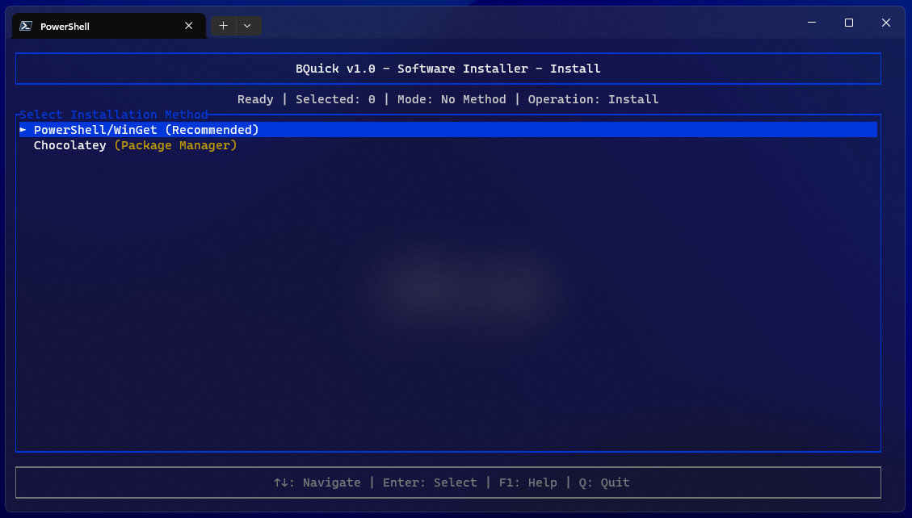
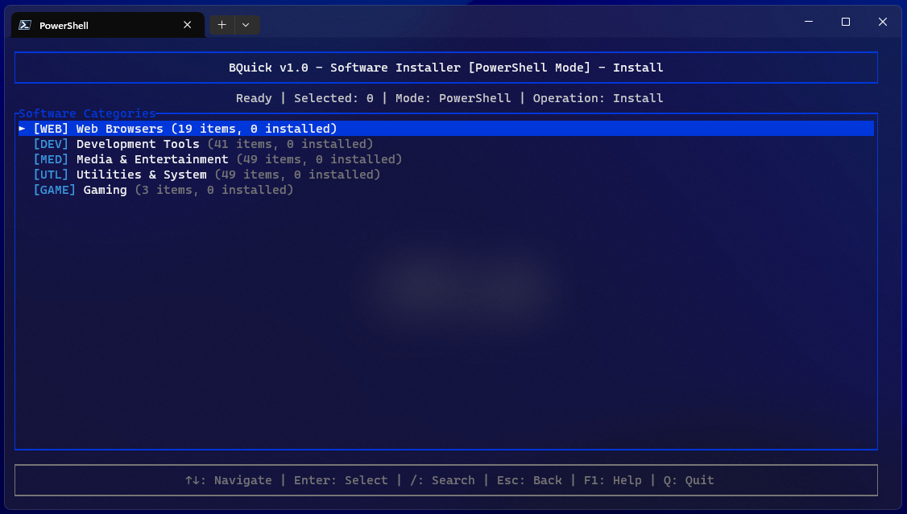
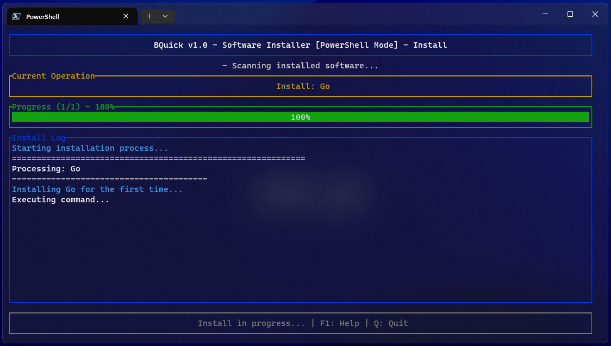

<h1 align="center">🚀 BQuick</h1>

<p align="center">
  <a href="https://microsoft.com/windows">
    
  </a>
  <a href="https://www.rust-lang.org/">
    
  </a>
  <a href="https://crates.io/crates/bquick">
    
  </a>
  <a href="LICENSE">
    
  </a>
</p>

<p align="center">
  <b>Professional Windows Software Installer</b><br>
  Simplifies app management with <b>WinGet</b> & <b>Chocolatey</b> in one clean interface.
</p>

---

## ✨ Features

- ⚡ Dual package managers (WinGet & Chocolatey)
- 🔍 Fuzzy search & filtering
- 🖥️ Intuitive terminal UI
- 📦 Batch operations for multiple installs
- 🎯 Curated list of **150+ essential applications**

---

## 📥 Installation

### ⚡ Quick Install

Run in an **elevated PowerShell**:

```powershell
# Download the installer
curl -L -o install.bat https://raw.githubusercontent.com/linux-brat/bquick/master/install.bat

# Run the installer (Right-click → Run as Administrator recommended)
Start-Process install.bat -Verb RunAs
```

### 🦀 Manual Install (via Rust)

```bash
cargo install bquick
```

---

## 🕹️ Usage

Launch the app:

```bash
bquick
```

### Controls:

- ⬆⬇ / `j-k` → Navigate
- ␣ Space → Select
- ⏎ Enter → Install
- ❌ Q → Quit

---

## 📂 Categories

| 🌐 Browsers | 💻 Development | 🎬 Media  | 🛠️ Utilities  |
| ----------- | -------------- | --------- | ------------- |
| Chrome      | VS Code        | VLC       | 7-Zip         |
| Firefox     | IntelliJ       | OBS       | PowerToys     |
| Edge        | Docker         | GIMP      | CCleaner      |
| Brave       | Git            | Audacity  | Wireshark     |
| Vivaldi     | Python         | HandBrake | CPU-Z         |
| Tor Browser | Node.js        | Krita     | TreeSize Free |

More check app list - [Click Me](App-List.txt)

---

## 🤝 Contribution

Contributions are welcome!
Fork this repo, edit `src/categories` to add software, and submit a PR 🚀

---

## 📜 License

Licensed under **MIT** — see [LICENSE](./LICENSE) for details.

---

## 📸 Screenshots

| Main UI                           | Installation Progress                           |
| --------------------------------- | ----------------------------------------------- |
|  |  |

| App List                           | Completed Installs                           |
| ---------------------------------- | -------------------------------------------- |
|  |  |
