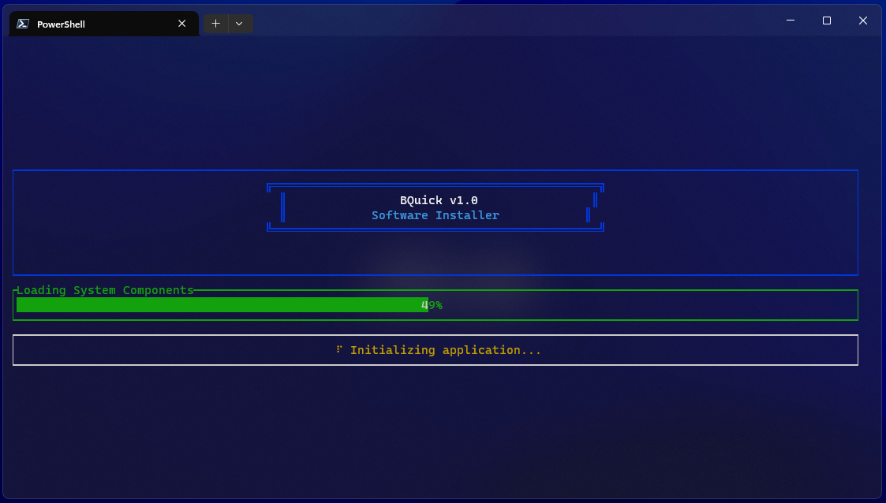

<div align="center">
<div align="center">

# 🚀 BQuick

**Professional Software Installer for Windows**


[](https://www.rust-lang.org/)

[](LICENSE)

**A terminal-based software installation manager that streamlines Windows software management through WinGet and Chocolatey.**

</div>

---

## ✨ Features

- 🔄 **Dual Package Manager Support** – WinGet/PowerShell + Chocolatey integration
- 🔍 **Smart Software Detection** – Scan registry, filesystem, and package databases
- 🎨 **Professional Terminal UI** – Modern interface with real-time progress tracking
- ⚡ **Multiple Operations** – Install, uninstall, reinstall with automatic fallbacks
- 📦 **Extensive Catalog** – 200+ apps across browsers, dev tools, media, and utilities
- 🔎 **Advanced Search** – Real-time fuzzy search across categories

---

## ⚙️ Installation

### Prerequisites

- **Rust & Cargo** → [Install Rust](https://rustup.rs/)
- **Windows 10/11 (64-bit)**

### Quick Install (PowerShell)

```powershell
# Automated installation script
Invoke-WebRequest -Uri "https://raw.githubusercontent.com/linux-brat/bquick/master/install.ps1" -OutFile "install.ps1"
powershell -ExecutionPolicy Bypass -File "install.ps1"
```

### Direct Cargo Install

```bash
cargo install bquick
```

or

```bash
cargo install --git https://github.com/linux-brat/bquick.git
```

---

## 🎮 Usage

```bash
# Launch BQuick
bquick
```

- Navigate with arrow keys or `j/k`
- `Space` → Select software
- `Enter` → Start installation
- `Q` → Quit

### 🔑 Key Controls

| Key          | Action           |
| ------------ | ---------------- |
| `↑↓` / `j k` | Navigate         |
| `Space`      | Toggle selection |
| `Enter`      | Confirm / Start  |
| `A`          | Select all       |
| `U`          | Uninstall mode   |
| `F5`         | Deep scan        |
| `/`          | Search           |
| `Q`          | Quit             |

---

## 📸 Screenshots

<p align="center">
  
  
</p>

<p align="center">
  
  
</p>

---

## 🤝 Contributing

1. Fork the repository
2. Create your feature branch (`git checkout -b feature/name`)
3. Commit changes (`git commit -m 'Add feature'`)
4. Push to branch (`git push origin feature/name`)
5. Open a Pull Request

---

## 📜 License

MIT License – see [LICENSE](LICENSE) for details.

---

<div align="center">

**🦀 Built with Rust** • **🪟 Designed for Windows** • **💡 Powered by Community**

</div>
